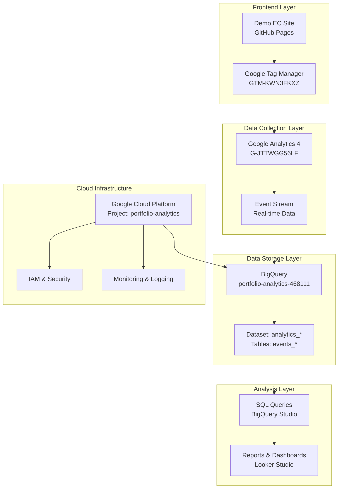
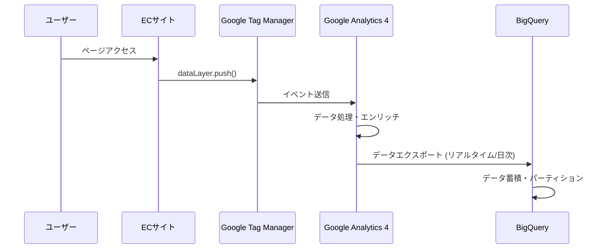
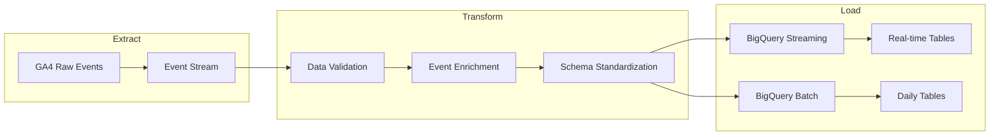
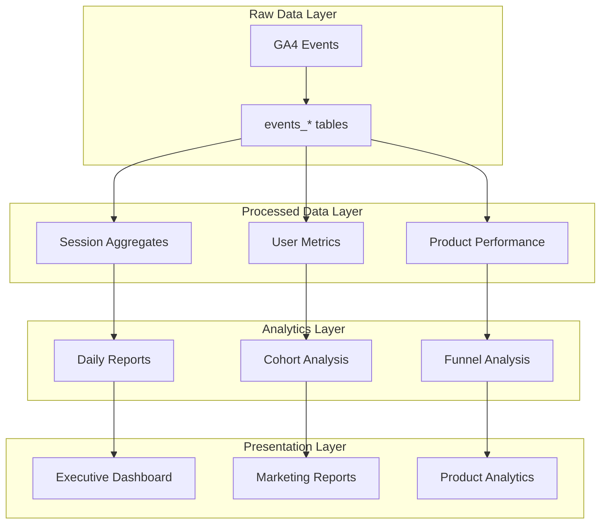

# システムアーキテクチャ設計書

## 🏗️ 全体アーキテクチャ



## 📊 データフロー設計

### 1. データ収集フロー



### 2. イベント追跡設計

| イベント名 | トリガー | 送信データ | ビジネス価値 |
|-----------|---------|-----------|-------------|
| `page_view` | ページ読み込み | page_title, page_location | トラフィック分析 |
| `view_item` | 商品クリック | item_id, item_name, price | 商品人気度 |
| `add_to_cart` | カート追加ボタン | item_id, item_name, value, currency | 購入意向 |
| `purchase` | 購入完了 | transaction_id, value, items[] | 売上・ROI |

## 🛠️ 技術スタック詳細

### Frontend Architecture

```yaml
Technology Stack:
  - HTML5: セマンティックマークアップ
  - CSS3: 
    - Grid/Flexbox Layout
    - CSS Variables
    - Animation/Transition
    - Responsive Design
  - JavaScript:
    - ES6+ Features
    - Event Handling
    - LocalStorage (将来実装)
    - Fetch API (将来実装)
  
Hosting:
  - GitHub Pages
  - Custom Domain (将来実装)
  - SSL/TLS 自動対応
```

### Analytics Architecture

```yaml
GA4 Configuration:
  Property ID: G-JTTWGG56LF
  Stream ID: 11853173183
  Enhanced Ecommerce: Enabled
  Custom Dimensions:
    - User Segment
    - Product Category
    - Traffic Source
  
GTM Configuration:
  Container ID: GTM-KWN3FKXZ
  Tags:
    - GA4 Configuration Tag
    - GA4 Event Tags (4種類)
  Triggers:
    - Page View
    - Click Events
    - Custom Events
  Variables:
    - GA4 Measurement ID
    - DataLayer Variables
```

### Data Architecture

```yaml
BigQuery Structure:
  Project: portfolio-analytics-468111
  Dataset: analytics_[PROPERTY_ID]
  Tables:
    - events_YYYYMMDD (日次データ)
    - events_intraday_YYYYMMDD (リアルタイム)
  
Partitioning:
  - Time-based partitioning by event_date
  - Clustering by event_name, user_pseudo_id
  
Schema:
  - event_date: STRING
  - event_timestamp: INTEGER
  - event_name: STRING
  - user_pseudo_id: STRING
  - event_params: RECORD (REPEATED)
```

## 🔐 セキュリティ設計

### 1. データプライバシー

```yaml
Privacy Controls:
  - IP Anonymization: Enabled
  - Data Retention: 14 months (GA4 default)
  - User Deletion: Automatic after retention period
  - GDPR Compliance: Ready for implementation
  
Data Access:
  - Project Owner: Full access
  - BigQuery User: Query-only access
  - Service Account: Automated processing only
```

### 2. IAM (Identity and Access Management)

```yaml
Roles & Permissions:
  Owner:
    - roles/owner (Project level)
    - Full BigQuery Admin
    - GA4 Property Admin
  
  Analyst:
    - roles/bigquery.user
    - roles/bigquery.dataViewer
    - GA4 Property Viewer
  
  Service Account:
    - roles/bigquery.jobUser
    - Custom role for specific operations
```

## 📈 スケーラビリティ設計

### 1. パフォーマンス最適化

```yaml
BigQuery Optimization:
  Query Performance:
    - Partitioned Tables
    - Clustered Tables
    - Materialized Views (将来実装)
    - Query Cache活用
  
  Cost Optimization:
    - Slot reservation (将来実装)
    - Query result caching
    - Efficient WHERE clauses
    - SELECT specific columns only
```

### 2. 拡張性考慮

```yaml
Scalability Features:
  Data Volume:
    - Auto-scaling BigQuery slots
    - Partitioning strategy
    - Data lifecycle management
  
  User Load:
    - CDN integration (将来実装)
    - Load balancing (将来実装)
    - Caching strategy
  
  Geographic Expansion:
    - Multi-region deployment
    - Data localization
    - Compliance considerations
```

## 🔄 データパイプライン設計

### 1. ETL Process



### 2. データ品質管理

```yaml
Data Quality Checks:
  Validation Rules:
    - Required fields validation
    - Data type validation
    - Value range validation
    - Referential integrity
  
  Monitoring:
    - Data freshness alerts
    - Volume anomaly detection
    - Schema drift detection
    - Error rate monitoring
  
  Remediation:
    - Automatic retry logic
    - Dead letter queues
    - Manual intervention triggers
    - Data backfill procedures
```

## 📊 分析基盤設計

### 1. データモデリング

```yaml
Dimensional Model:
  Fact Tables:
    - events (grain: individual event)
    - sessions (grain: user session)
    - transactions (grain: purchase)
  
  Dimension Tables:
    - users (user attributes)
    - products (product catalog)
    - time (date dimensions)
    - geography (location data)
```

### 2. レポーティング階層



## 🚀 将来拡張計画

### Phase 2: 高度な分析機能

```yaml
Advanced Analytics:
  Machine Learning:
    - BigQuery ML integration
    - Predictive analytics
    - Customer lifetime value
    - Churn prediction
  
  Real-time Processing:
    - Dataflow streaming
    - Pub/Sub messaging
    - Real-time dashboards
    - Alert systems
```

### Phase 3: マルチソース統合

```yaml
Data Integration:
  Additional Sources:
    - CRM data (Salesforce)
    - Email marketing (MailChimp)
    - Social media APIs
    - Customer support data
  
  Unified Analytics:
    - Customer 360 view
    - Attribution modeling
    - Multi-touch journey analysis
    - Cross-channel optimization
```

## 📋 運用・保守設計

### 1. モニタリング

```yaml
Operational Monitoring:
  Infrastructure:
    - BigQuery job success rates
    - Query performance metrics
    - Storage utilization
    - Cost tracking
  
  Data Quality:
    - Data completeness
    - Data accuracy
    - Schema compliance
    - Business logic validation
```

### 2. 災害復旧

```yaml
Disaster Recovery:
  Backup Strategy:
    - Cross-region replication
    - Point-in-time recovery
    - Data export procedures
    - Configuration backups
  
  Recovery Procedures:
    - RTO: 4 hours
    - RPO: 1 hour
    - Failover automation
    - Data integrity verification
```

## 📞 技術サポート体制

### 1. ドキュメント管理

```yaml
Documentation:
  Technical Docs:
    - API documentation
    - Query library
    - Troubleshooting guide
    - Best practices
  
  Business Docs:
    - KPI definitions
    - Report specifications
    - User guides
    - Training materials
```

### 2. 変更管理

```yaml
Change Management:
  Version Control:
    - Git-based workflow
    - Code review process
    - Testing procedures
    - Deployment automation
  
  Release Management:
    - Feature flags
    - Canary deployments
    - Rollback procedures
    - Change approval process
```

---

**このアーキテクチャは実践的なデータ分析基盤として設計されており、スケーラビリティと保守性を重視しています。**
